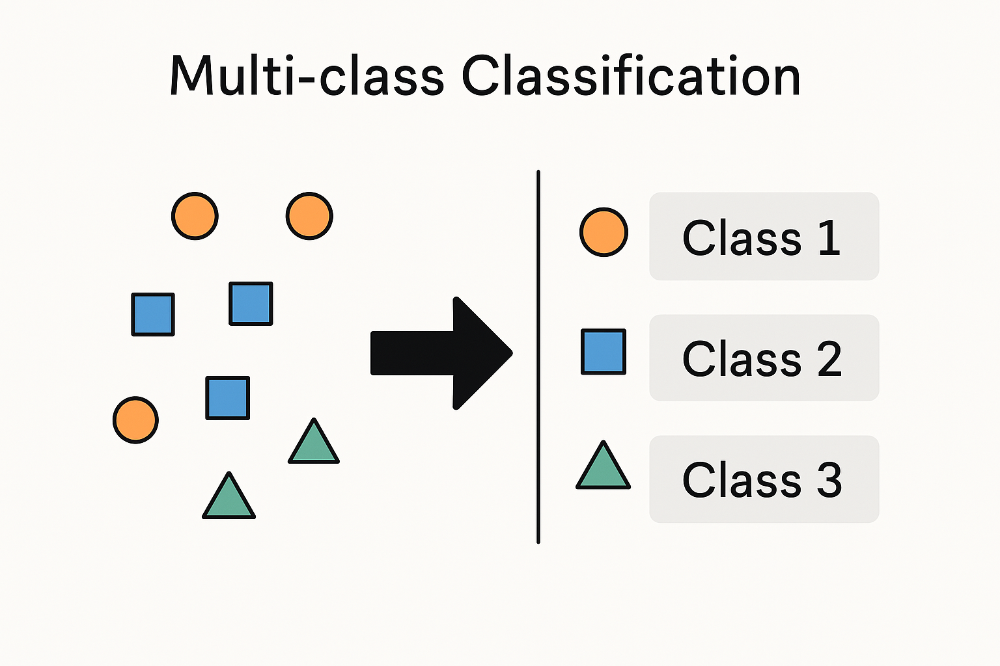
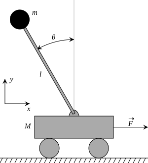
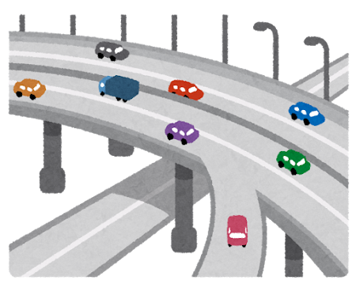
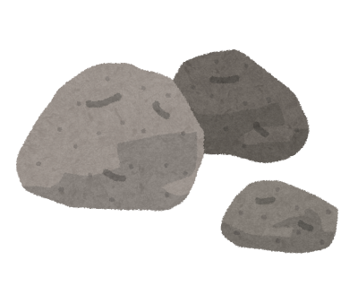

# マルコフ決定過程を学ぶモチベ

---
maxDepth: 1
layout: default
---

<Toc />

---

## 社会と意思決定問題

社会の様々なサービスは何らかの意思決定をしている．

<br>

* 動画配信サービス
  * 意思決定：ユーザーの履歴に合わせて動画を推薦
  * 目標：サービスの収益を最大化させる推薦


<br>
<br>

* 医師の診断
  * 意思決定：患者の症状に合わせて治療法を選択
  * 目標：患者の症状の改善


<br>

<div style="border: 2px solid #000; padding: 10px; margin-top: 20px; background-color: #ffffe0;">
良い意思決定はサービスの質を向上させる．良い意思決定をするにはどうすればよいだろう？ 🤔
</div>


---

## 意思決定のルール

意思決定は何らかの**ルール**を通じて実現される．

意思決定のルール $\approx$ 「<span style="color: red;">状況</span>に対して<span style="color: blue;">意思決定</span>を返す関数」


<div style="border: 2px solid #000; padding: 10px; margin-top: 20px; background-color: #f5f5f5;">

**ルールの例** （映画の推薦サービス）

* 短期的なルール：<span style="color: red;">ユーザーは昨日ホラー映画を見た．</span>
→ <span style="color: blue;">次回もホラー映画を推薦しよう．</span>
* 長期的なルール：<span style="color: red;">ホラーを推薦しても飽きそう．</span>
→ <span style="color: blue;">ホラーだけでなく，流行の映画も推薦しよう．</span>

</div>

<br>
<br>

<v-click>

<div style="border: 2px solid #000; padding: 10px; margin-top: 20px; background-color: #ffffe0;">

* 講義では「短期と長期，どちらを優先するべきか？(what)」は学ばない．サービスの運営者次第．\
（講義終盤で扱うかも）
* 講義では **「意思決定のルールをどうやって設計するのか？(how)」** を扱う．

</div>

</v-click>

---

## 意思決定のルールの難しさと定式化の重要性

短期よりも長期の方が一般に実現が難しい．

* 短期的なルールの実装は簡単．ユーザーが今まで見てたジャンルの動画を見せれば良い．

```python

def recommend_movie(previous_movie_type):
    # 直前の映画のジャンルと同じジャンルの映画を推薦
    next_movie = get_random_movie(previous_movie_type)
    return next_movie
```

<br>

<v-click>

* 長期的なルールの実装が難しい．１年間でのユーザーの満足度を最大化させるには？

```python

def recommend_movie(movie_history):
    # ユーザーの視聴履歴はあるけど，何をすれば満足度が最大化される？
    next_movie = ???
    return next_movie
```

</v-click>

<v-click>

<div style="border: 2px solid #000; padding: 10px; margin-top: 20px; background-color: #ffffe0;">

ふわふわした要件では，意思決定のルールを設計するのは難しい．（🤔 そもそも短期と長期って何？）\
💡そこで，**マルコフ決定過程**を使って意思決定問題を定式化＆意思決定のルールを計算しよう．
</div>

</v-click>

---

## マルコフ決定過程の実用例

<br>



<figure style="position: absolute; top: 200px; right: 80px; width: 130px; text-align: center;">
  
  <figcaption style="font-size: 0.5em; word-wrap: break-word; text-align: center;">
    <a href="https://en.wikipedia.org/wiki/Inverted_pendulum" target="_blank">https://en.wikipedia.org/wiki/Inverted_pendulum</a>
  </figcaption>
</figure>



* 多クラス分類問題 （他講義で説明）
* システムの制御 （制御工学の線形二次レギュレータなど．他講義で説明）
* ポートフォリオ最適化問題 <span style="font-size: 70%;">[Bäuerle+, 2011]</span>
* 高速道路の舗装問題 <span style="font-size: 70%;">[Puterman+, 1994]</span>
* テレビゲーム・囲碁・将棋
* 対話システム （ChatGPTとか）
* 他多数．調べてみてね．

<br><br>

<div style="border: 2px solid #000; background-color: #ffffe0; text-align: center;">

💪 マルコフ決定過程の応用先は多岐にわたる！正しい知識を身に着けよう．

</div>

<!-- 引用元 -->
<div style="font-size: 0.7em; text-align: left; position: absolute; bottom: 10px; left: 10px;">

* [Bäuerle+, 2011] Markov Decision Processes with Applications to Finance
* [Puterman+, 1994] Markov Decision Processes: Discrete Stochastic Dynamic Programming

</div>

---
theme: default
highlighter: shiki
transition: slide-left
layout: section
class: 'text-center'
---

# マルコフ決定過程

---
maxDepth: 1
layout: default
---

<Toc />

---

## マルコフ決定過程 （Markov Decision Process）

以降はMarkov Decision Processを略して**MDP**と呼ぶ

* 概要：意思決定の流れをシンプルに記述した数理モデルのこと．

<v-click>
<div style="border: 2px solid #000; padding: 10px; margin-top: 20px; background-color: #ffffe0;">

**MDPの定義**：
次の４つの要素からなるタプル $(\mathcal{S}, \mathcal{A}, P, r)$ のこと

$$
\begin{aligned}
  &状態集合\; \mathcal{S} &&｜現在の状況を表す状態の集合\\
  &行動集合\; \mathcal{A} &&｜選択できる意思決定の集合\\
  &遷移確率関数\; P: \mathcal{S} \times \mathcal{A} \to \Delta(\mathcal{S}) &&｜各状態と行動について，次の状態遷移を決める関数\\
  &報酬関数\; r: \mathcal{S} \times \mathcal{A} \to \mathbb{R}&&｜各状態行動の「良さ」を表現する関数\\
\end{aligned}
$$

ここで，$\Delta(\mathcal{S})$は$\mathcal{S}$上の確率分布の集合を表す．

</div>

<div style="border: 2px solid #000; padding: 10px; margin-top: 20px;">
💡次のスライド以降で定義の直感を学ぶが，頻出なので基本的に暗記してほしい．

</div>

</v-click>

---

## MDPを使った意思決定の流れ


* 意思決定者のことを**エージェント**と呼ぶ．
* エージェントを取り巻く問題設定を**環境**と呼ぶ．（MDPのことを環境と呼ぶこともある）
  * ⚠️ 「エージェント」と「環境」は厳密な定義ではない．
* 意思決定のルールを**方策**と呼ぶ．定義は色々ある（後述）．\
  ↓の図は定常方策のときの意思決定の流れ（方策 $\pi: \mathcal{S} \to \Delta(\mathcal{A})$）

<br>


<figure style="position: absolute; bottom: 50px; left: 80px; width: 130px; text-align: center;">
  
  <figcaption style="text-align: center; position: absolute; top: -20px; left: 10px;">エージェント</figcaption>
  <figcaption style="text-align: center; position: absolute; bottom: -30px; left: 0px; width: 150px; font-size: 0.8em;"> 
  
  初期状態 $s_1 \in \mathcal{S}$ 
  </figcaption>
</figure>

<figure style="position: absolute; bottom: 130px; left: 400px; width: 100px; text-align: center;">
  
  
  <figcaption style="position: absolute; top: 70px; left: -70px; width: 300px; text-align: center; font-size: 0.8em;">
  
  状態 $s_2 \sim P(\cdot \mid s_1, a_1)$ 
  </figcaption>
</figure>

<Arrow x1="200" y1="450" x2="400" y2="410" />
<div style="position: absolute; bottom: 130px; left: 220px; text-align: center; font-size: 0.8em;">

  行動 $a_1 \sim \pi(\cdot \mid s_1)$\
  報酬 $r_1 = r(s_1, a_1)$

</div>

<figure style="position: absolute; bottom: 50px; left: 750px; width: 80px; text-align: center;">
  
  
  <figcaption style="position: absolute; top: 60px; left: -20px; width: 180px; text-align: center;font-size: 0.8em;">
  
  状態 $s_3 \sim P(\cdot \mid s_2, a_2)$ 
  </figcaption>
</figure>

<Arrow x1="540" y1="410" x2="740" y2="450" />
<div style="position: absolute; bottom: 130px; left: 580px; text-align: center; font-size: 14px;">

  行動 $a_2 \sim \pi(\cdot \mid s_2)$\
  報酬 $r_2 = r(s_2, a_2)$

</div>

<Arrow x1="880" y1="470" x2="1040" y2="400" />

<div style="position: absolute; top: 50%; transform: translateY(-50%); width: 800px; padding: 0px; border: 2px solid #000; background-color: #ffffe0; text-align: center; font-size: 14px;">

  MDPでは，次状態の遷移が直前の状態行動のみに依存している（$s_{t+1} \sim P(\cdot \mid s_t, a_t)$）．この性質をマルコフ性と呼ぶ．
</div>


---

## MDPの何が嬉しいのか？

🤔 < 現実世界ってMDPじゃなくない？\
　 　例えば企業で数ヶ月前の意思決定が今月反映される場合，月ごとにはマルコフ性成り立たない…\
　 　表現できない場合もありそうだし，役に立たないのでは？

👨‍🏫 < 確かにMDPの適用が非自明な場合もあるけど，大抵の場合は工夫でなんとかなるよ．\
　 　マルコフ性は設計者が無理やり作るもの．MDPにできれば，後で学ぶ強力なアルゴリズムが使える．


