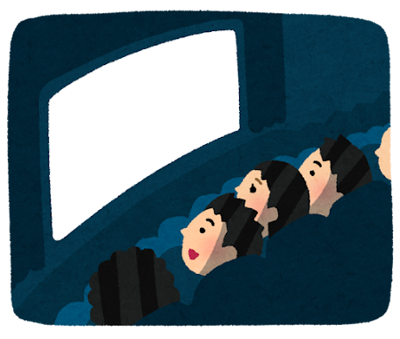

# 講義全体の目標

---

## 社会と意思決定問題

社会の様々なサービスは何らかの意思決定をしている．

<br>

* 動画配信サービス
  * 意思決定：ユーザーの履歴に合わせて動画を推薦
  * 目標：サービスの収益を最大化させる推薦


<br>
<br>

* 医師の診断
  * 意思決定：患者の症状に合わせて治療法を選択
  * 目標：患者の症状の改善


---

## 意思決定のルール

意思決定は何らかのルールを通じて実現される．




<br>
<br>

<div style="border: 2px solid #000; padding: 10px; margin-top: 20px;">
ユーザーは前回ホラー映画を見ていた．次は何を推薦しよう？

* 短期的なルール：ホラーが好きそうなので，次回もホラー映画を推薦しよう．
* 長期的なルール：ホラーを推薦しても飽きそう．長期のサブスクのために，流行の映画も推薦しよう．
</div>

<br>
<br>

<v-click>

* 講義では「短期と長期，どちらを優先するべきか？」は考えない．サービスの運営者次第なので．
* 講義では **「どうやって実現するのか？」** を扱う．

</v-click>

---

## 意思決定のルールの実現

短期よりも長期の方が一般に実現が難しい．

* 短期的なルールの実装は簡単．ユーザーが好きな動画を見せれば，短期的には満足するだろう．

```python

def recommend_movie(previous_movie_type):
    # 直前の映画のジャンルと同じジャンルの映画を推薦
    next_movie = get_random_movie(previous_movie_type)
    return next_movie
```

<br>

<v-click>

* 長期的なルールの実装が難しい．１年間でのユーザーの満足度を最大化させるには？

```python

def recommend_movie(movie_history):
    # ユーザーの視聴履歴はあるけど，何をすれば満足度が最大化される？
    next_movie = ???
    return next_movie
```

</v-click>

<v-click>

<div style="border: 2px solid #000; padding: 10px; margin-top: 20px; text-align: center;">
<strong>講義全体の目標</strong><br>

「意思決定のルールを計算する問題」を**マルコフ決定過程**を使って定式化＆それを解くアルゴリズムを学ぶ
</div>

</v-click>

---
maxDepth: 1
---


<Toc />

---
theme: default
highlighter: shiki
transition: slide-left
layout: section
class: 'text-center'
---

# マルコフ決定過程

---


